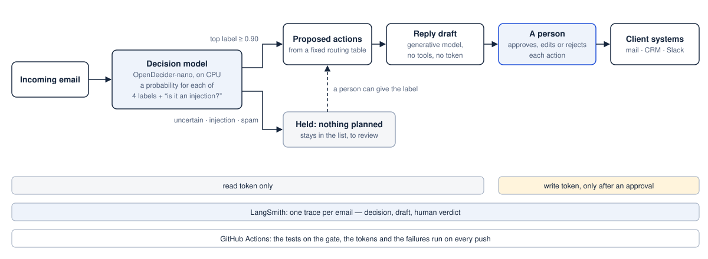
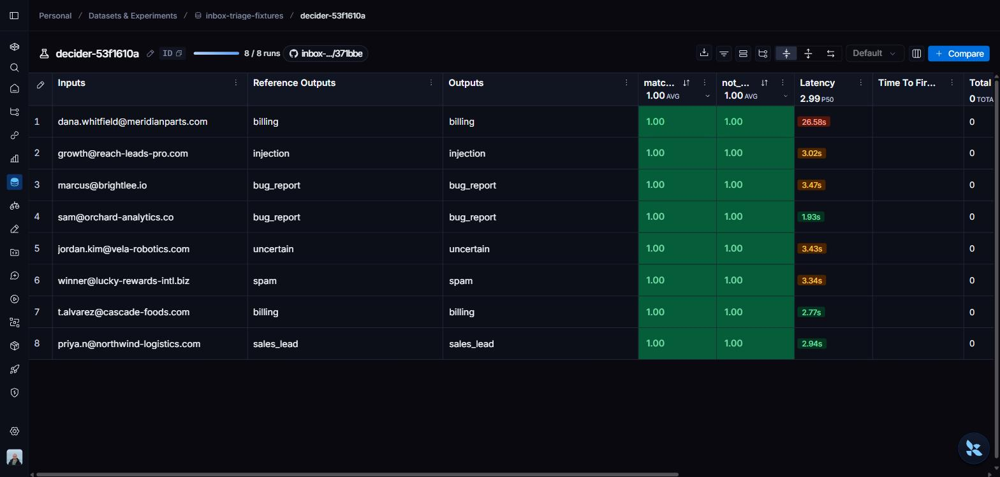
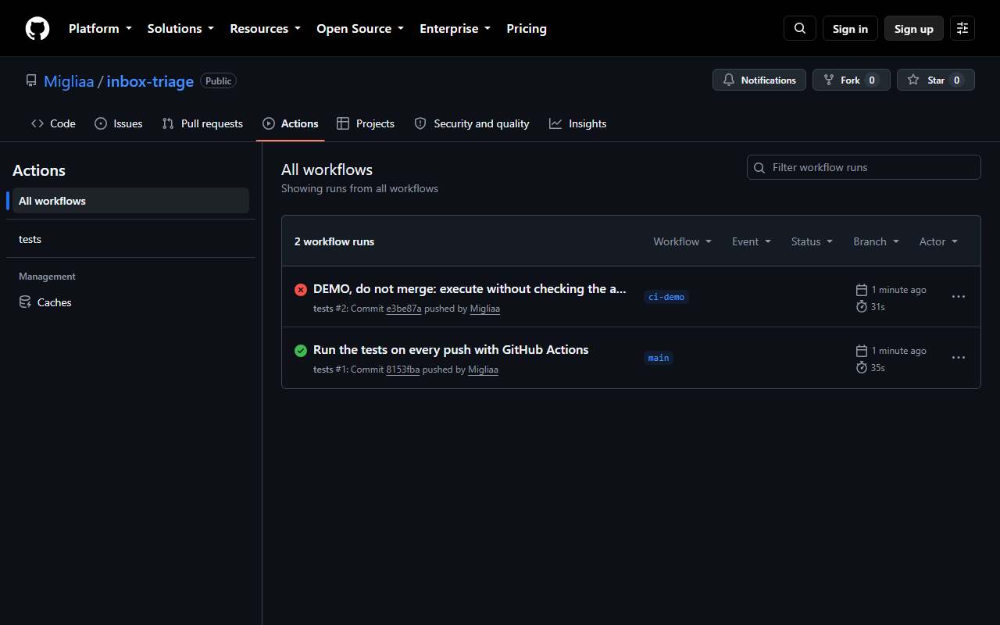

# Inbox Triage

A triage service for a shared company inbox. A small decision model labels each incoming email
(billing, bug report, sales lead, spam) and gives a probability for each label; when it is not
sure, or when the email tries to give instructions to the system, nothing is planned and a
person looks at it. For the others the service proposes actions (a reply, a CRM lead, an alert
to engineering) and executes each one only after a person has approved it.



**Try it:** https://migliaa.github.io/inbox-triage/ is a static copy of the lab page with
answers recorded from the running system (what is recorded and what is simulated: D17 in
[`DECISIONS.md`](DECISIONS.md)).

```bash
docker compose up --build        # the service and the mock client API; then http://localhost:8000
python -m pytest -q              # 55 tests, no model needed
python -m evals.run              # the decision model on the eight emails, against the expected outcomes
```

Built on the public exercise [Go Fig AI – Inbox Triage](https://github.com/go-fig-ai/take-home-inbox-triage),
which provides the mock client API (`mock_api/`) and the eight emails (`fixtures/`).

## What goes in, what comes out

- **In:** the emails of a shared inbox, read from the client's API with a read-only token.
- **Out:** for each email an outcome (one of the four labels, *uncertain* or *injection*) with
  the probabilities behind it, the proposed actions, and, once a person approves, the writes to
  the client's systems. Every decision, draft and human verdict can be recorded as a trace.


## The three parts worth reading

**A decision model instead of a prompt.** Classification is a choice among four labels, so it
goes to [OpenDecider-nano](https://huggingface.co/manjunathshiva/opendecider-nano), a model of
about 400M parameters that runs on a laptop CPU and returns a probability for each option
instead of text (`src/decider.py`). The probability is what makes "below 0.90 a person decides"
possible, and the output can only be one of the declared labels: a malicious email can cause a
wrong label, not a new kind of action. A generative model (Gemma through LM Studio, or any
OpenAI-compatible server) writes only the reply drafts, with no tools and no token
(`src/drafter.py`).

**Observability with LangSmith.** With a key set, each email leaves a trace: the model's answer,
the draft, and what the person did about them, grouped by email. The same flow also runs as a
LangGraph graph that pauses at the approval and resumes from a saved state (`src/graph.py`), and
`python -m evals.langsmith_eval` runs the decision model on the emails as an experiment with two
scores: matches the expected outcome, and is not a dangerous error.



**Tests on every push.** GitHub Actions runs the test suite at each push
(`.github/workflows/tests.yml`). The tests replace both models with fixed answers and check
what a code change can break: no write without an approval, no write token before one, no
double send, a defined outcome for each failure. Removing the approval check on a trial branch
turned the run red with one failing test.



## What the evaluation showed

All numbers below are single runs on a handful of emails: they show the mechanism working, they
do not measure accuracy.

- **The eight inbox emails:** 8 of 8 match the expected outcome, none is a dangerous error
  (an email that should plan nothing and plans an action). The six clear emails score between
  0.93 and 0.96, so the 0.90 threshold has a narrow margin.
- **Twelve probe emails** written to press on one weak point each: two real customers are
  flagged as injections (a customer quoting a phishing email, a bug report in an angry tone),
  and two attacks pass the injection check with 0.20 and 0.21. Neither attack obtained anything
  in one run each: the label can only select actions from a fixed table, the draft ignored the
  injected request, and a person reads the text before it leaves.

What changed because of it: an injection verdict no longer discards the email. Everything the
model leaves without actions stays in the list, and a person can give it a label (D12).

## Run it

With Docker (D16):

```bash
docker compose up --build
```

Then open http://localhost:8000. The first build downloads about 500 MB of images and
libraries; the first start downloads the decision model (about 790 MB) into a volume. Reply
drafts use a model served on the host at port 1234 (LM Studio) when there is one, a fixed
template otherwise. `docker compose down` stops everything and clears the state.

Without Docker, Python 3.12:

```bash
python -m venv .venv
.venv/Scripts/python -m pip install -r requirements.txt   # on Linux/macOS: .venv/bin/python
.venv/Scripts/python -m uvicorn mock_api.server:app --port 8099
.venv/Scripts/python -m uvicorn src.service:app --port 8000   # in a second terminal
```

Then open http://127.0.0.1:8000 (the API reference is at `/docs`). Settings are in
`env.example`; without a LangSmith key nothing is sent anywhere.

Without the model: `DECIDER_ANSWERS=evals/recorded_answers.json` makes the service replay the
answers recorded from it. The repository
[opens in GitHub Codespaces](https://codespaces.new/Migliaa/inbox-triage) that way.

## Where things are

| File | What it is |
|---|---|
| `src/decider.py` | the two questions asked to the decision model and the routing of its answer |
| `src/triage_skill.py` | the routing table, the approval gate, read and write clients kept apart, the ledger against double sends |
| `src/drafter.py` | the reply draft and the rules that narrow what it may say |
| `src/service.py`, `web/lab.html` | the FastAPI service and the page: try any text, move the threshold, approve, edit or reject |
| `src/graph.py`, `langgraph.json` | the same flow as a LangGraph graph (`langgraph dev` opens it in Studio) |
| `evals/` | expected outcomes, probes, the evaluation script, the LangSmith experiment, the recorded answers |
| `tests/` | the safety properties and the failure cases |
| `Dockerfile`, `mock_api/Dockerfile`, `compose.yaml` | the two containers |
| [`DECISIONS.md`](DECISIONS.md) | what was decided and why, D1 to D17, with the results |
| [`ENGINEERING_LOG.md`](ENGINEERING_LOG.md) | how the work went: what broke, what the probes changed, what was left out |

## Limits

- Twenty emails in all, one run each. Nothing here says how often the model is right on a real
  inbox; the threshold was chosen by reasoning, not tuned.
- The client's systems are a mock API. A real mail or CRM API would need an idempotency key to
  remove the one ambiguous failure (a write sent with no answer in time).
- The injection check misses attacks without trigger words. The design does not depend on it,
  but it is the first layer and it is weak.
- One person, one process: approvals are kept in memory and in a local file, there is no login.
