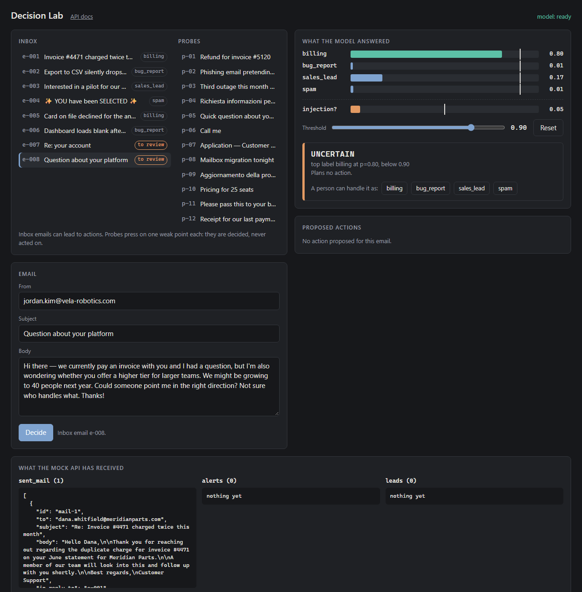

# Inbox Triage

Work in progress. A triage service for a shared company inbox: it reads incoming emails, decides
what each one is (billing, bug report, sales lead, spam), flags attempts to give instructions to
the system, proposes an action, and executes it only after a person approves.

Built on the public exercise [Go Fig AI – Inbox Triage](https://github.com/go-fig-ai/take-home-inbox-triage),
which provides the mock client API (`mock_api/`) and the eight emails (`fixtures/`).

## What is here

- `src/decider.py`: a small decision model that runs locally on CPU and returns a probability for
  each label; below a threshold the email is left to a person.
- `src/triage_skill.py`: the routing table, the approval gate, read and write tokens kept apart.
- `src/service.py`, `web/lab.html`: a page to try the decider on any text and to approve, reject
  or edit the proposed actions.
- `DECISIONS.md`: what was decided and why, with the results on the eight emails and on eight
  probe emails. Both are single runs on a handful of emails: they show the mechanism, they do not
  measure accuracy.



## Run it

Python 3.12. The first start downloads the decision model (about 790 MB).

```bash
python -m venv .venv
.venv/Scripts/python -m pip install -r requirements.txt   # on Linux/macOS: .venv/bin/python
.venv/Scripts/python -m uvicorn mock_api.server:app --port 8099
.venv/Scripts/python -m uvicorn src.service:app --port 8000   # in a second terminal
```

Then open http://127.0.0.1:8000 (the API reference is at `/docs`).

```bash
.venv/Scripts/python -m pytest -q        # safety properties, no model needed
.venv/Scripts/python -m evals.run        # the eight emails against the expected outcomes
```

## Still to come

Generated reply drafts, failure handling, orchestration with LangGraph, Docker, CI, tracing.
